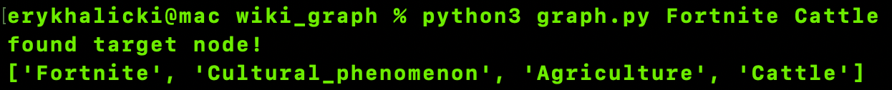

# Wikipedia Graph Searcher

The Wikipedia Graph Searcher takes in a Wikipedia link and constructs a directed graph of web pages connected to the original link.

It currently utilizes breadth-first search to recursively create a graph of links, starting at a root Wikipedia page

Once the graph is made, it can be queried for the shortest path between 2 links, as shown below

## Fortnite -> Cattle

## Game -> Canada

## Some visualizations

