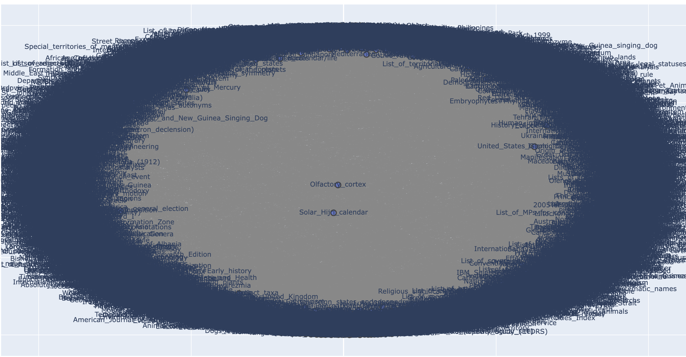
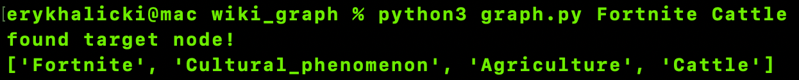

# Wikipedia Graph Searcher

The Wikipedia Graph Searcher is a program that finds the connection between any two Wikipedia pages by following links.

It ranks the links within the page using Jaccard Similarity, then progresses through Best-First Search until it finds the final page.

Below are some example runs:

## Daft Punk -> Korean Fried Chicken

##Older versions
The following are screenshots of older versions of the program, when it was utilizing breadth first search and Dijkstra's algorithm

### Some visualizations

### Fortnite -> Cattle

### Game -> Canada

