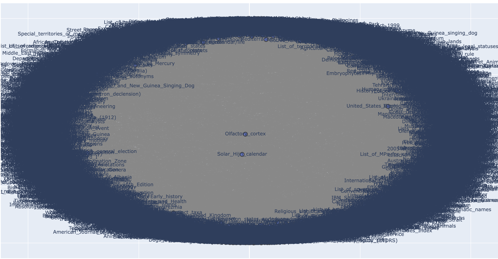

# Wikipedia Graph Searcher

The Wikipedia Graph Searcher takes in a Wikipedia link and constructs a directed graph of webpages connected to the original link.

It currently utilizes breadth-first search to recursively create a graph containing every link in the starting Wikipedia page

I will soon implement an A* type path finding algorithm that can find the shortest path between 2 pages (distance being the amount of link jumps)

